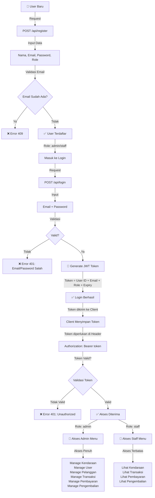
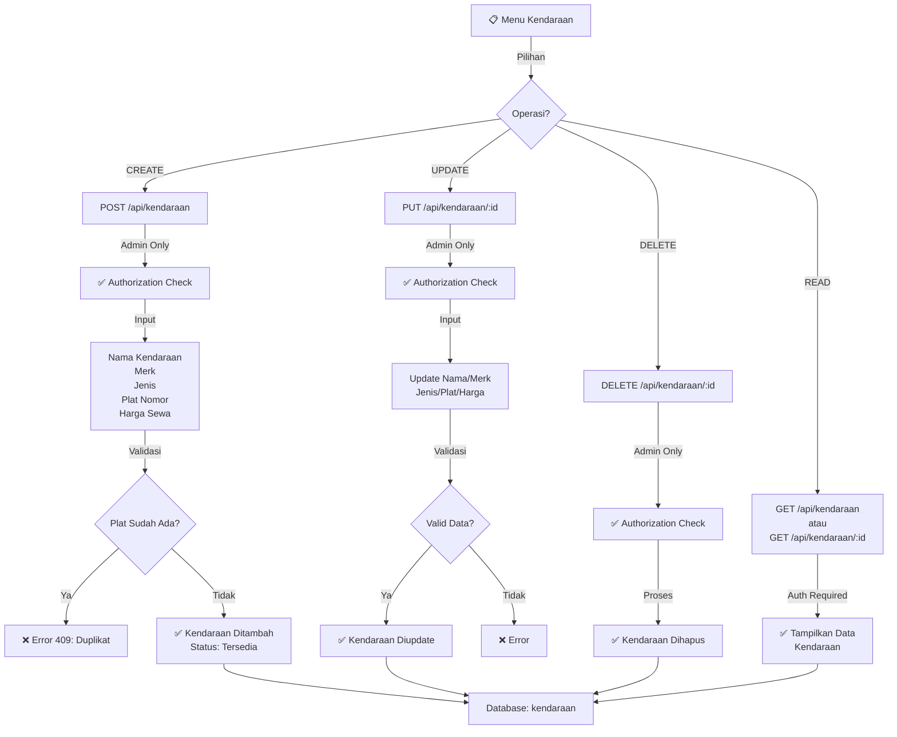
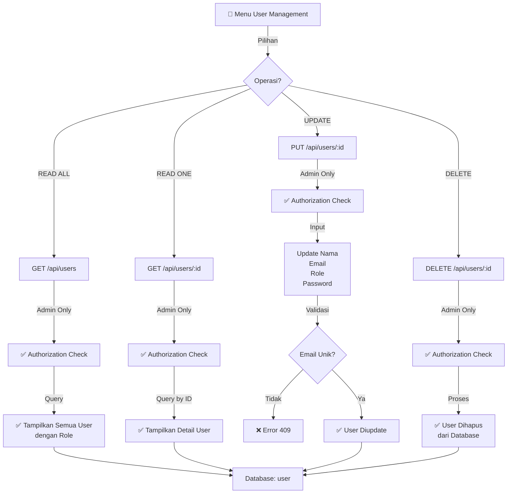
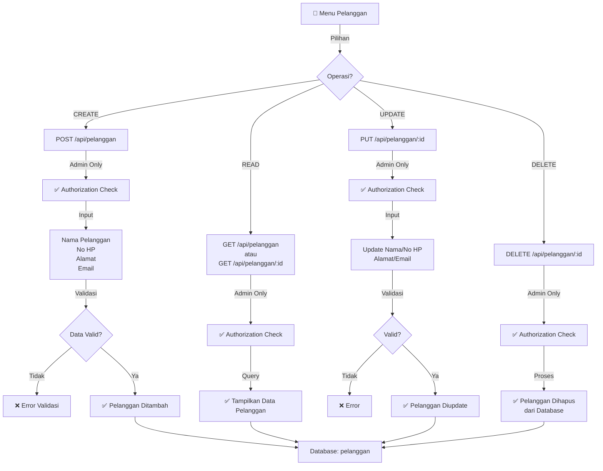
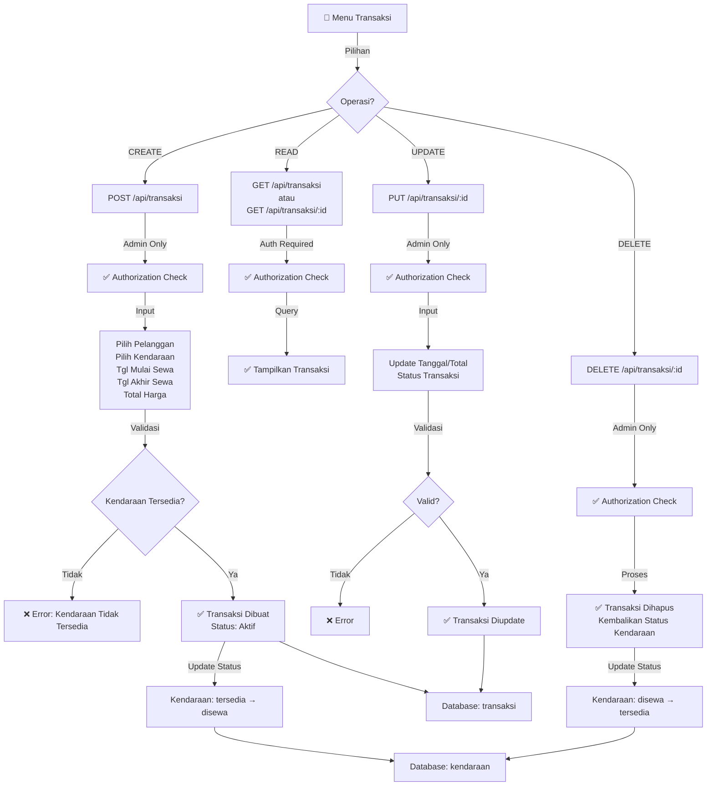
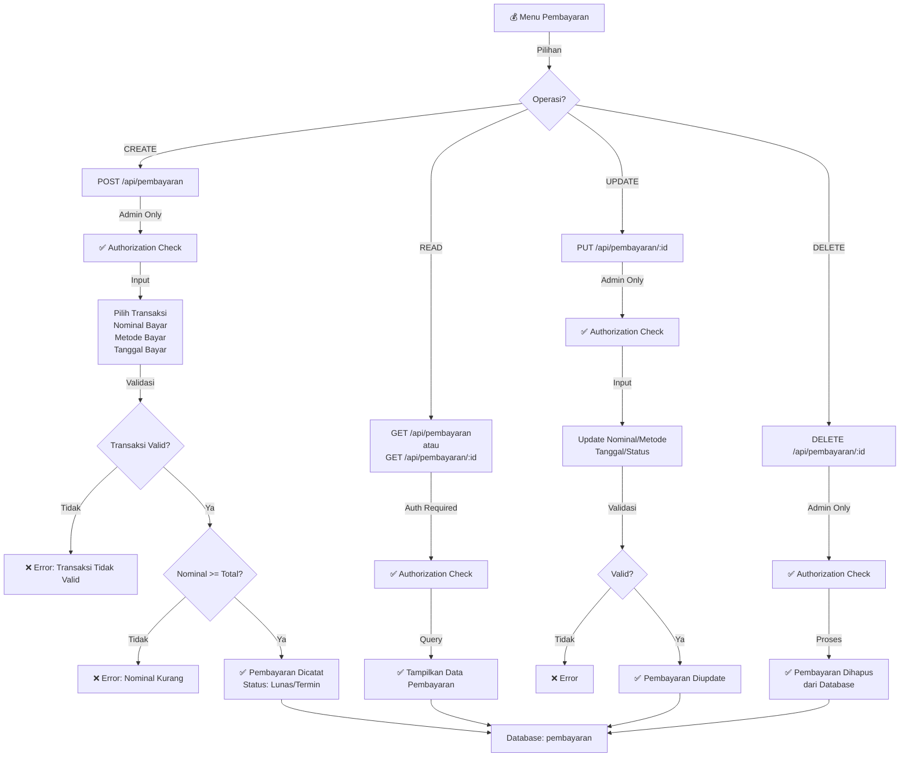
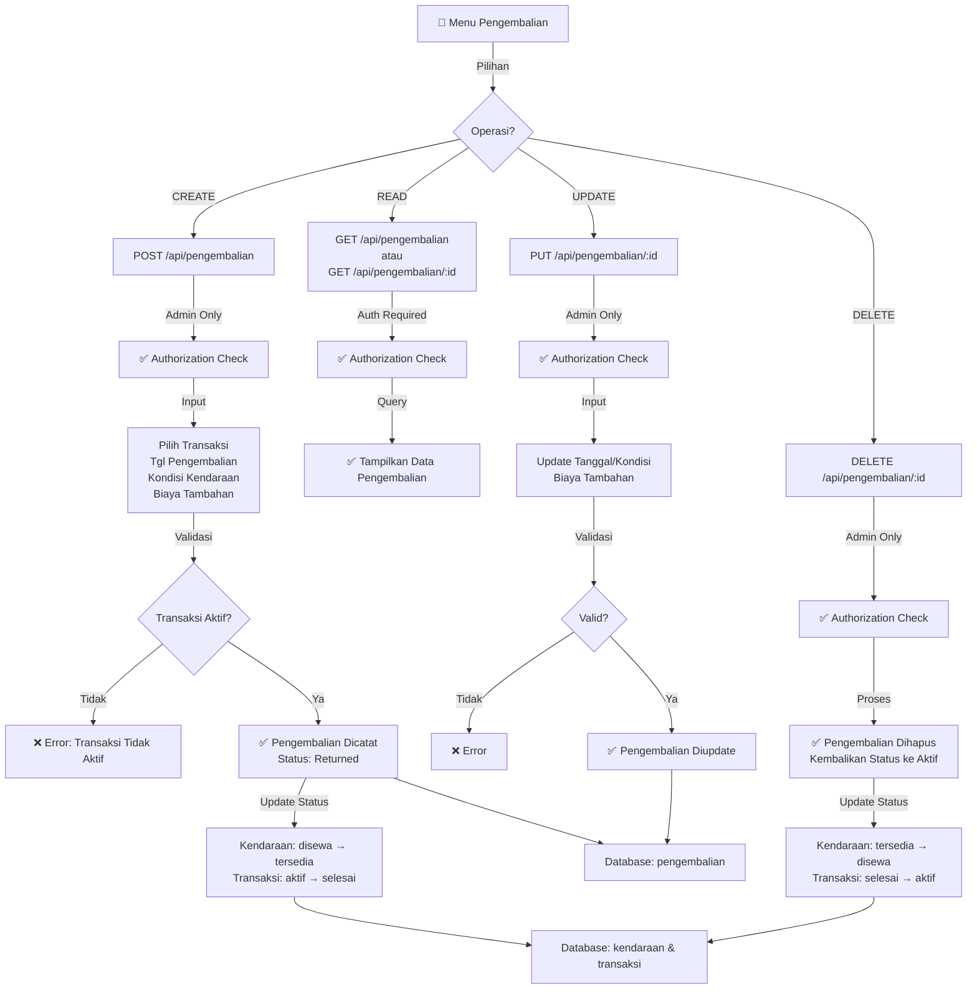
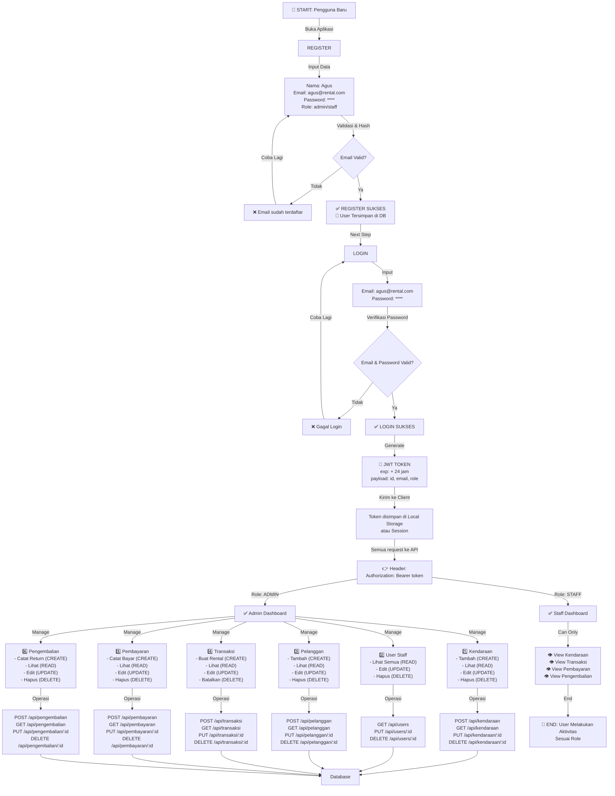
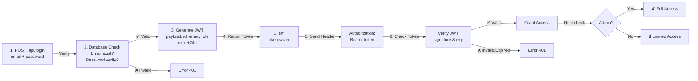
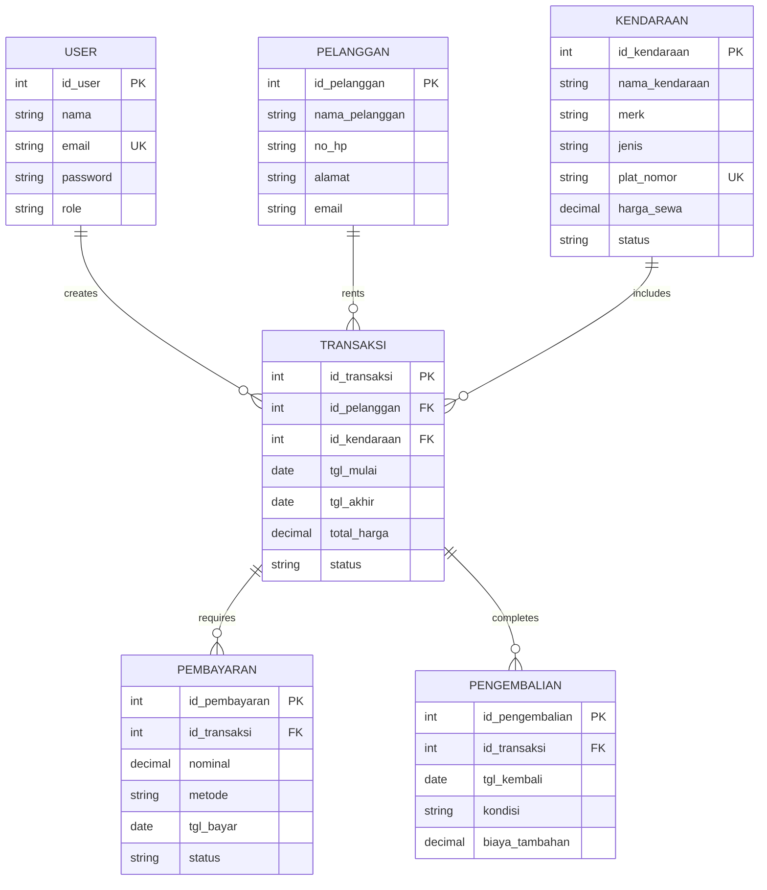

# Alur Kerja Sistem Rental Kendaraan

## 1. Diagram Alur Utama Sistem

---

## 2. Alur Manajemen Kendaraan (CRUD)

---

## 3. Alur Manajemen User (CRUD)

---

## 4. Alur Manajemen Pelanggan (CRUD)

---

## 5. Alur Manajemen Transaksi (CRUD)

---

## 6. Alur Manajemen Pembayaran (CRUD)

---

## 7. Alur Manajemen Pengembalian (CRUD)

---

## 8. Alur Lengkap: Dari Register Hingga Selesai (Complete User Journey)

---

## 9. Tabel Ringkasan Endpoint & Access Control

| Endpoint | Method | Role | Deskripsi | Input |
|----------|--------|------|-----------|-------|
| `/api/register` | POST | Public | Daftar User Baru | nama, email, password, role |
| `/api/login` | POST | Public | Login & Dapatkan Token | email, password |
| **USER** |
| `/api/users` | GET | Admin | Lihat Semua User | - |
| `/api/users/:id` | GET | Admin | Lihat User Detail | - |
| `/api/users/:id` | PUT | Admin | Update User | nama, email, role, password |
| `/api/users/:id` | DELETE | Admin | Hapus User | - |
| **KENDARAAN** |
| `/api/kendaraan` | GET | Auth | Lihat Semua Kendaraan | - |
| `/api/kendaraan/:id` | GET | Auth | Lihat Detail Kendaraan | - |
| `/api/kendaraan` | POST | Admin | Tambah Kendaraan | nama_kendaraan, merk, jenis, plat_nomor, harga_sewa |
| `/api/kendaraan/:id` | PUT | Admin | Update Kendaraan | nama_kendaraan, merk, jenis, plat_nomor, harga_sewa |
| `/api/kendaraan/:id` | DELETE | Admin | Hapus Kendaraan | - |
| **PELANGGAN** |
| `/api/pelanggan` | GET | Auth | Lihat Semua Pelanggan | - |
| `/api/pelanggan/:id` | GET | Auth | Lihat Detail Pelanggan | - |
| `/api/pelanggan` | POST | Admin | Tambah Pelanggan | nama_pelanggan, no_hp, alamat, email |
| `/api/pelanggan/:id` | PUT | Admin | Update Pelanggan | nama_pelanggan, no_hp, alamat, email |
| `/api/pelanggan/:id` | DELETE | Admin | Hapus Pelanggan | - |
| **TRANSAKSI** |
| `/api/transaksi` | GET | Auth | Lihat Semua Transaksi | - |
| `/api/transaksi/:id` | GET | Auth | Lihat Detail Transaksi | - |
| `/api/transaksi` | POST | Admin | Buat Transaksi Rental | pelanggan_id, kendaraan_id, tgl_mulai, tgl_akhir, total_harga |
| `/api/transaksi/:id` | PUT | Admin | Update Transaksi | pelanggan_id, kendaraan_id, tgl_mulai, tgl_akhir, total_harga, status |
| `/api/transaksi/:id` | DELETE | Admin | Batalkan Transaksi | - |
| **PEMBAYARAN** |
| `/api/pembayaran` | GET | Auth | Lihat Semua Pembayaran | - |
| `/api/pembayaran/:id` | GET | Auth | Lihat Detail Pembayaran | - |
| `/api/pembayaran` | POST | Admin | Catat Pembayaran | transaksi_id, nominal, metode, tgl_bayar |
| `/api/pembayaran/:id` | PUT | Admin | Update Pembayaran | nominal, metode, tgl_bayar, status |
| `/api/pembayaran/:id` | DELETE | Admin | Hapus Pembayaran | - |
| **PENGEMBALIAN** |
| `/api/pengembalian` | GET | Auth | Lihat Semua Pengembalian | - |
| `/api/pengembalian/:id` | GET | Auth | Lihat Detail Pengembalian | - |
| `/api/pengembalian` | POST | Admin | Catat Pengembalian | transaksi_id, tgl_kembali, kondisi, biaya_tambahan |
| `/api/pengembalian/:id` | PUT | Admin | Update Pengembalian | tgl_kembali, kondisi, biaya_tambahan |
| `/api/pengembalian/:id` | DELETE | Admin | Hapus Pengembalian | - |

---

## 10. Flow Autentikasi & JWT Token

---

## 11. Database Relationships

---

## 📝 Catatan Penting

### Status Kendaraan:
- **tersedia**: Kendaraan siap disewa
- **disewa**: Sedang disewa (ada transaksi aktif)
- **maintenance**: Dalam perbaikan

### Status Transaksi:
- **aktif**: Rental sedang berlangsung
- **selesai**: Rental selesai & kendaraan sudah dikembalikan
- **batal**: Rental dibatalkan

### Status Pembayaran:
- **lunas**: Sudah dibayar penuh
- **termin**: Pembayaran dalam cicilan
- **pending**: Menunggu pembayaran

### Autentikasi:
- **Token JWT** digunakan untuk autentikasi semua API
- **Authorization Check**: Setiap request diverifikasi tokennya
- **Role-Based Access Control**: Admin punya akses penuh, Staff hanya view
- **Token Expiry**: 24 jam (bisa dikonfigurasi di JWT_EXPIRE)

### Validasi Penting:
1. Email unik saat register & update user
2. Plat nomor unik saat tambah & update kendaraan
3. Kendaraan harus tersedia saat membuat transaksi
4. Transaksi harus aktif saat membuat pengembalian
5. Nominal pembayaran harus sesuai atau lebih dari total harga

---

## 🎯 Ringkasan Flow Utama

1. **REGISTER** → Validasi email unik → Hash password → Simpan ke DB
2. **LOGIN** → Verifikasi email & password → Generate JWT → Return token
3. **REQUEST** → Kirim token di header → Validasi token → Check role
4. **ADMIN** → Akses penuh CRUD semua entity
5. **STAFF** → Hanya READ akses ke Kendaraan, Transaksi, Pembayaran, Pengembalian
6. **CRUD OPERATIONS** → Validasi input → Update/Delete di DB → Return response

---

*Dokumen ini menjelaskan alur kerja lengkap sistem rental kendaraan Anda untuk keperluan laporan.*
